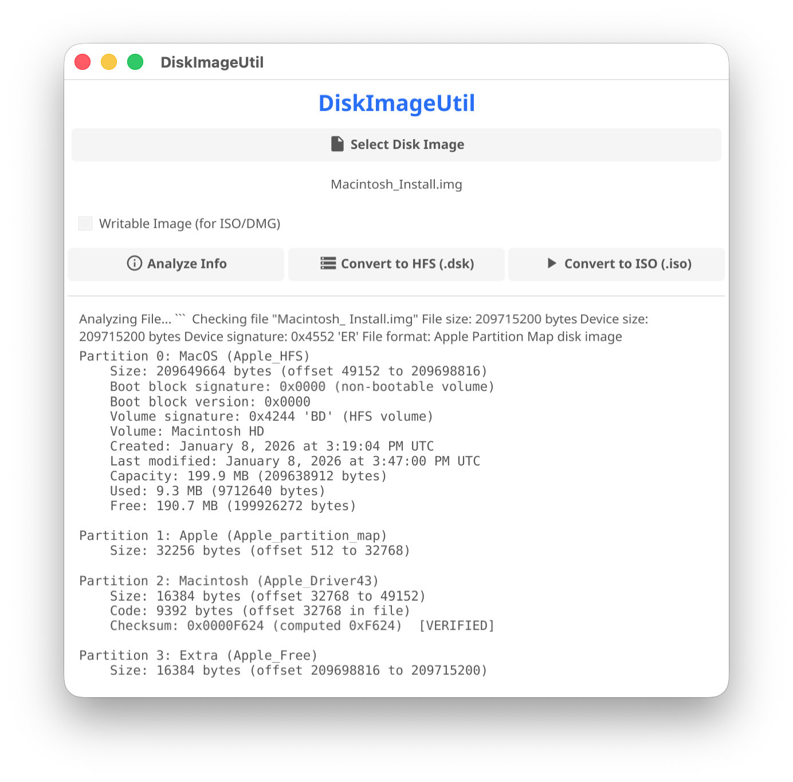

  

# diskimageutil GoUI
**Convert and repair Apple HFS disk image files**

**Summary**

diskimageutil is a command-line tool that can convert between raw volume image (.dsk) and device image (.dmg or .iso) formats, producing a file which can be opened in an emulator. Run the tool in Terminal with no arguments to see its options.

...
[Original README.md](README.original.md)
